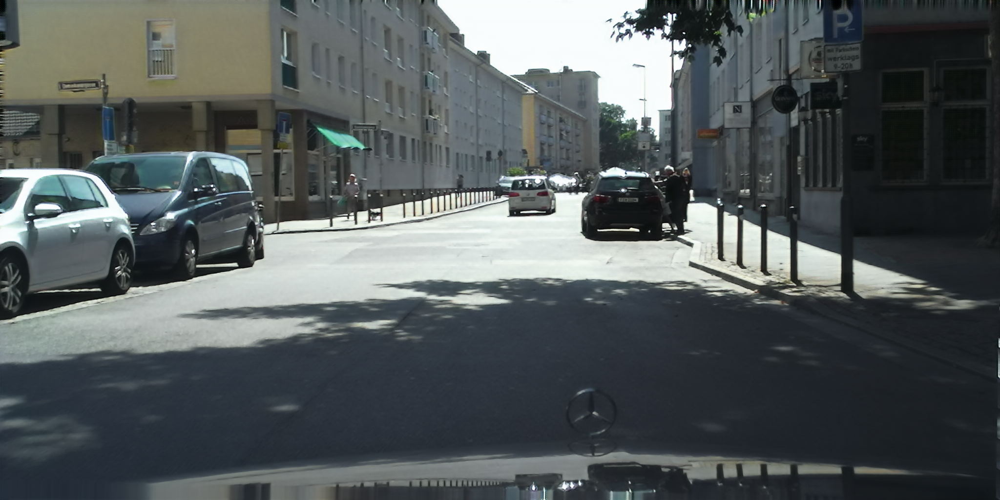

# CycleGAN

This project implements Cycle GAN from scratch and tries to transform the images in the Cityscapes dataset to the IDD style.

## Experimental Results

First, we try the same experiment as the paper to validate the correctness.

### Horse to Zebra

<table>
  <tr>
    <td>Description</td>
    <td>Input image</td>
    <td>Result</td>
  </tr>
  <tr>
    <td>Horse to zebra</td>
    <td></td>
    <td></td>
  </tr>
  <tr>
    <td>Zebra to horse</td>
    <td></td>
    <td></td>
  </tr>
</table>

### Cityscapes to IDD

From the following results, we can notice:
1. When transforming the high-resolution images like in Cityscapes, we should add up the identity loss; otherwise, the results will look like negative film images.
2. It is better to use the random crop instead of resizing during the data pre-processing. The higher resolution pre-processed images help get better results.
3. Using more residual blocks to train on the high-resolution images is not better; sometimes, the buildings in the images will disappear.

<table>
  <tr>
    <td>Domain</td>
    <td>Input image</td>
    <td>Random crop by 256 w/o identity loss</td>
  </tr>
  <tr>
    <td>Cityscapes to IDD</td>
    <td></td>
    <td></td>
  </tr>
  <tr>
    <td>IDD to Cityscapes</td>
    <td></td>
    <td></td>
  </tr>
</table>

<table>
  <tr>
    <td>Domain</td>
    <td>Input image</td>
    <td>Random crop by 1024 w/o identity loss</td>
  </tr>
  <tr>
    <td>Cityscapes to IDD</td>
    <td></td>
    <td></td>
  </tr>
  <tr>
    <td>IDD to Cityscapes</td>
    <td></td>
    <td></td>
  </tr>
</table>

<table>
  <tr>
    <td>Domain</td>
    <td>Input image</td>
    <td>Random crop by 256 w/ identity loss</td>
  </tr>
  <tr>
    <td>Cityscapes to IDD</td>
    <td></td>
    <td></td>
  </tr>
  <tr>
    <td>IDD to Cityscapes</td>
    <td></td>
    <td></td>
  </tr>
</table>

<table>
  <tr>
    <td>Domain</td>
    <td>Input image</td>
    <td>Random crop by 1024 w/ identity loss</td>
  </tr>
  <tr>
    <td>Cityscapes to IDD</td>
    <td></td>
    <td></td>
  </tr>
  <tr>
    <td>IDD to Cityscapes</td>
    <td></td>
    <td></td>
  </tr>
</table>

<table>
  <tr>
    <td>Domain</td>
    <td>Input image</td>
    <td>Random crop by 1024 w/ identity loss and use 15 residual blocks</td>
  </tr>
  <tr>
    <td>Cityscapes to IDD</td>
    <td></td>
    <td></td>
  </tr>
  <tr>
    <td>IDD to Cityscapes</td>
    <td></td>
    <td></td>
  </tr>
</table>

<table>
  <tr>
    <td>Domain</td>
    <td>Input image</td>
    <td>Reize by 1024 w/ identity loss</td>
  </tr>
  <tr>
    <td>Cityscapes to IDD</td>
    <td></td>
    <td></td>
  </tr>
  <tr>
    <td>IDD to Cityscapes</td>
    <td></td>
    <td></td>
  </tr>
</table>
