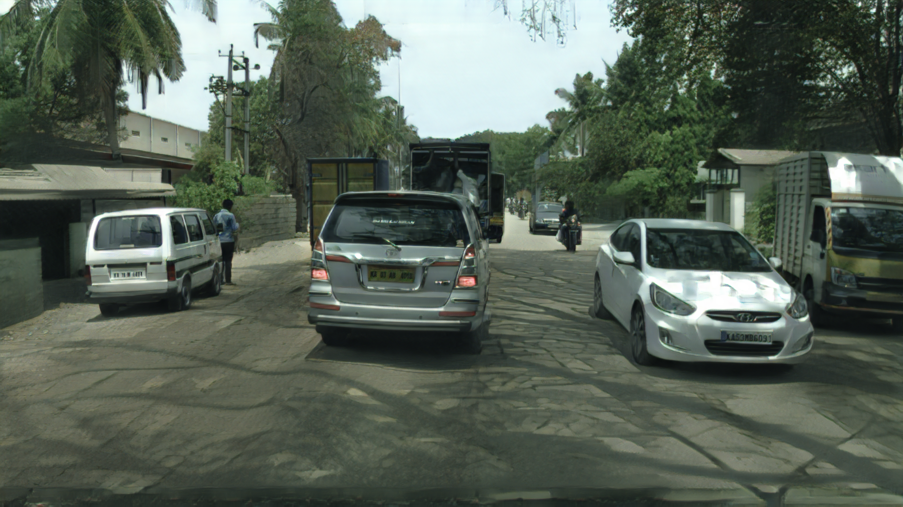
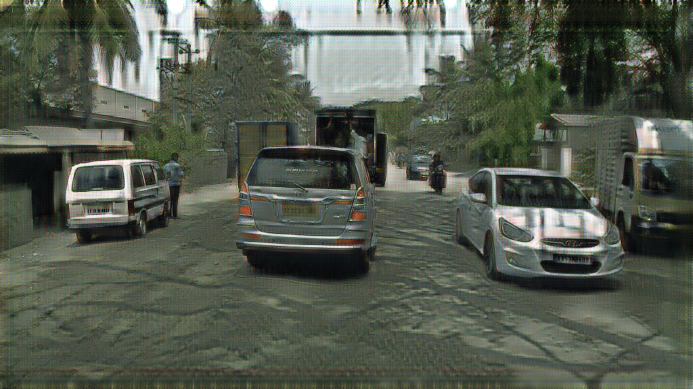

# CycleGAN

## Experimental Results

### Horse to Zebra

<table>
  <tr>
    <td>Description</td>
    <td>Input image</td>
    <td>Result</td>
  </tr>
  <tr>
    <td>Horse to zebra</td>
    <td></td>
    <td></td>
  </tr>
  <tr>
    <td>Zebra to horse</td>
    <td></td>
    <td></td>
  </tr>
</table>

### Cityscapes to IDD

<table>
  <tr>
    <td>Domain</td>
    <td>Input image</td>
    <td>Random crop by 256 w/o identity loss</td>
    <td>Random crop by 1024 w/o identity loss</td>
    <td>Random crop by 256 w/ identity loss</td>
  </tr>
  <tr>
    <td>Cityscapes to IDD</td>
    <td></td>
    <td></td>
    <td></td>
    <td></td>
  </tr>
  <tr>
    <td>IDD to Cityscapes</td>
    <td></td>
    <td></td>
    <td></td>
    <td></td>
  </tr>
</table>

<table>
  <tr>
    <td>Domain</td>
    <td>Input image</td>
    <td>Random crop by 1024 w/ identity loss</td>
    <td>Random crop by 1024 w/ identity loss and use 15 residual blocks</td>
    <td>Reize by 1024 w/ identity loss</td>
  </tr>
  <tr>
    <td>Cityscapes to IDD</td>
    <td></td>
    <td></td>
    <td></td>
    <td></td>
  </tr>
  <tr>
    <td>IDD to Cityscapes</td>
    <td></td>
    <td></td>
    <td></td>
    <td></td>
  </tr>
</table>
